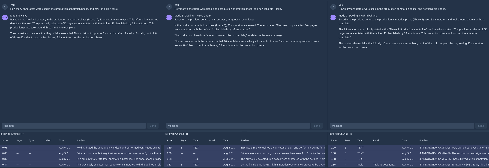
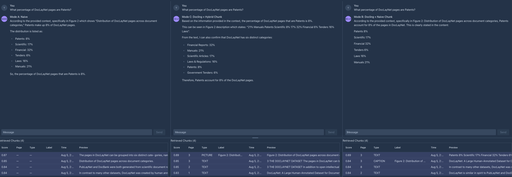
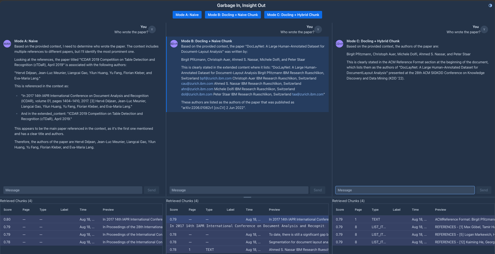
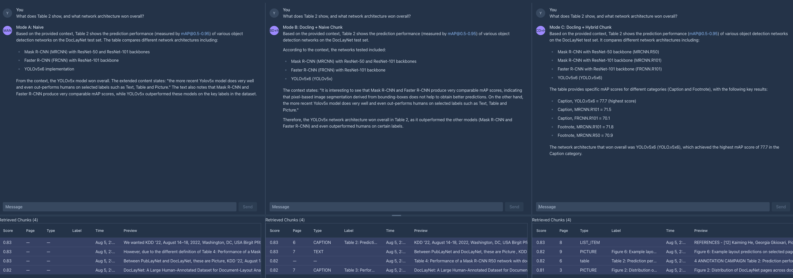
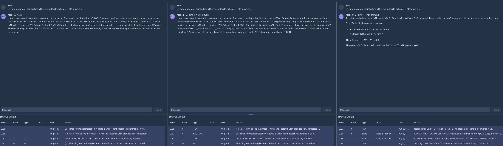

# Garbage In, Insight Out

Demo application for the talk *"Garbage In, Insight Out: Document Intelligence for AI-Infused Java Applications"*. It demonstrates how document extraction quality and chunking strategy directly affect RAG (Retrieval-Augmented Generation) answer accuracy, using Quarkus, LangChain4j, and Docling Java.

## Three Modes

The app runs the same RAG pipeline three times, changing exactly one variable each time:

| Mode | Extractor | Chunker | What it proves |
|------|-----------|---------|----------------|
| **A** (Naive) | Apache Tika (plain text) | Sentence splitter + context enrichment | Bad extraction ruins answers even with a good chunker |
| **B** (Docling + Naive Chunk) | Docling (structured extraction) | Same sentence splitter as A | Better extraction = better answers, same chunker |
| **C** (Docling + Hybrid Chunk) | Docling (structured extraction) | Docling hybrid chunker (server-side) | Structure-aware chunking = even better answers |

## Demo Flow

1. **Cold open (Mode A only):** Ask a question about the DocLayNet paper. Get a wrong answer. Blame the model — then reveal the real cause: garbled extraction.
2. **Closing verdict (Mode A vs B side-by-side):** Same question, right answer this time. Extraction is the only thing that changed.
3. **Advanced payoff (Mode B vs C):** A question that only Mode C answers correctly, because the hybrid chunker preserves table structure that the naive chunker loses.

## Prerequisites

- Java 25 (Temurin recommended)
- Maven 3.9+ (wrapper included: `./mvnw`)
- Docker or Podman (for Quarkus dev services: PostgreSQL, Docling Serve, Ollama)
- Ollama with models pulled (for dev mode — dev services handle this automatically):
  - `qwen3:30b-a3b` (LLM, ~16 GB)
  - `nomic-embed-text` (embeddings, 274 MB)

## Running

### Dev mode

```shell
./mvnw quarkus:dev
```

Opens at [localhost:8080](http://localhost:8080). Dev services automatically start PostgreSQL (pgvector), Docling Serve, and Ollama containers. First startup is slow (model pulling + document ingestion).

### Tests

```shell
./mvnw test
```

Tests use WireMock to stub the LLM chat endpoint (no real LLM needed for most tests). Embeddings use real Ollama via dev services. Diagnostic/simulation tests are skipped by default.

### Diagnostic tests

```shell
./mvnw test -Drun.simulations=true
```

Runs simulation tests that output chunk analysis to the console for manual inspection. Requires a real Docling Serve instance (dev services will start one).

- [`ChunkSizeSimulationTest`](src/test/java/dev/ericdeandrea/docling/ai/ingestion/pipeline/ChunkSizeSimulationTest.java) — splits the document at multiple `maxTokens` values and reports whether Table 2 values get fragmented. This is how `maxTokens=300` was determined.
- [`ModeAvsModeBTest`](src/test/java/dev/ericdeandrea/docling/ai/ingestion/pipeline/ModeAvsModeBTest.java) — side-by-side comparison of Mode A (Tika) vs Mode B (Docling) chunks for Table 2. Shows the quality difference from extraction alone.

### Planted questions validation

```shell
./mvnw test -Drun.planted-questions=true
```

Runs [`PlantedQuestionsValidationTest`](src/test/java/dev/ericdeandrea/docling/ai/PlantedQuestionsValidationTest.java), which needs a real LLM (not WireMock). Skipped by default.

### Capturing Docling responses

```shell
./mvnw test -Dcapture.docling.responses=true
```

Runs [`CaptureDoclingResponsesTest`](src/test/java/dev/ericdeandrea/docling/ai/ingestion/extraction/CaptureDoclingResponsesTest.java), which calls a real Docling Serve instance and writes the JSON responses to `src/test/resources/__files/`. These captured files are what the WireMock stubs serve back during tests. Run this when upgrading Docling Serve or changing the fixture PDF.

### WireMock testing

Tests use [WireMock](https://docs.quarkiverse.io/quarkus-wiremock/dev/index.html) for fast, deterministic test execution:

- **LLM chat** — always stubbed in test profile via [`openai-chat-completions.json`](src/test/resources/mappings/openai-chat-completions.json). Real Ollama not needed for chat in tests.
- **Docling Serve** — conditionally stubbed via [`DoclingWiremockTestProfile`](src/test/java/dev/ericdeandrea/docling/DoclingWiremockTestProfile.java). Pass `-Duse.wiremock.docling=true` to use stubs (CI does this); omit for real Docling (local default).
- **Embeddings** — always real Ollama (via dev services). Needed for meaningful vector search.

## Architecture

```
dev.ericdeandrea.docling
├── ai/                           # AI service, RAG augmentor, mode selection
│   └── ingestion/                # Ingestion orchestrator
│       ├── extraction/           # How documents are extracted
│       │   ├── TikaExtractor           (Mode A)
│       │   ├── DoclingNaiveExtractor   (Mode B)
│       │   └── DoclingHybridExtractor  (Mode C)
│       ├── chunking/             # How text is split
│       │   └── NaiveChunker          (Modes A/B)
│       └── pipeline/             # Mode compositions (self-documenting)
│           ├── TikaNaiveIngestionPipeline        (Mode A)
│           ├── DoclingNaiveIngestionPipeline     (Mode B)
│           └── DoclingHybridIngestionPipeline    (Mode C)
├── mapping/                      # MapStruct mappers (AI ↔ model boundary)
├── model/                        # Value objects (records) — no framework types
└── ui/                           # Vaadin chat views
```

The AI and UI layers are decoupled via the [`model`](src/main/java/dev/ericdeandrea/docling/model/) package. LangChain4j types never cross into the UI layer. [`MapStruct mappers`](src/main/java/dev/ericdeandrea/docling/mapping/ChunkMapper.java) handle conversion at the boundary.

### Key classes

- [`AssistantService`](src/main/java/dev/ericdeandrea/docling/ai/AssistantService.java) — public chat API; maps LangChain4j events to model types
- [`ChatService`](src/main/java/dev/ericdeandrea/docling/ai/ChatService.java) — package-private `@RegisterAiService` with RAG streaming
- [`ModeAwareRetrievalAugmentor`](src/main/java/dev/ericdeandrea/docling/ai/rag/ModeAwareRetrievalAugmentor.java) — selects the pgvector store per mode
- [`IngestionStartup`](src/main/java/dev/ericdeandrea/docling/ai/ingestion/IngestionStartup.java) — startup orchestrator, iterates over pipelines
- [`TikaNaiveIngestionPipeline`](src/main/java/dev/ericdeandrea/docling/ai/ingestion/pipeline/TikaNaiveIngestionPipeline.java) / [`DoclingNaiveIngestionPipeline`](src/main/java/dev/ericdeandrea/docling/ai/ingestion/pipeline/DoclingNaiveIngestionPipeline.java) / [`DoclingHybridIngestionPipeline`](src/main/java/dev/ericdeandrea/docling/ai/ingestion/pipeline/DoclingHybridIngestionPipeline.java) — mode pipelines
- [`TikaExtractor`](src/main/java/dev/ericdeandrea/docling/ai/ingestion/extraction/TikaExtractor.java) (Mode A) / [`DoclingNaiveExtractor`](src/main/java/dev/ericdeandrea/docling/ai/ingestion/extraction/DoclingNaiveExtractor.java) (Mode B) / [`DoclingHybridExtractor`](src/main/java/dev/ericdeandrea/docling/ai/ingestion/extraction/DoclingHybridExtractor.java) (Mode C) — extraction strategies
- [`NaiveChunker`](src/main/java/dev/ericdeandrea/docling/ai/ingestion/chunking/NaiveChunker.java) — sentence splitter + context enrichment
- [`ChatView`](src/main/java/dev/ericdeandrea/docling/ui/ChatView.java) — Vaadin multi-panel layout with toggle buttons; toggling a mode hides/shows its panel (kept in fixed A→B→C order) rather than destroying it, so a mode's chat and chunk history survive being toggled off and back on
- [`ChatPanel`](src/main/java/dev/ericdeandrea/docling/ui/ChatPanel.java) — per-mode chat + chunk display panel

## Planted Questions

Ordered least → most dramatic for the demo narrative.

### 1. Prose baseline (all modes equal)

> "How many annotators were used in the production annotation phase, and how long did it take?"

All three modes answer correctly: 32 annotators, approximately three
months. Plain prose text — proves all modes handle unstructured text
equally well. *"See? They all work."*



### 2. Figure/chart data (all modes answer)

> "What percentage of DocLayNet pages are Patents?"

All three modes answer correctly (8%). Mode C retrieves a synthetic
picture segment containing the Figure 2 chart labels
([spec 006](specs/006-orphaned-chart-text/spec.md)). *"Chart data
works too — still no difference."*



### 3. Author metadata (Mode A gets it wrong)

> "Who wrote the paper?"

- **Mode A:** Wrong — pulls author names from the *references* section
  instead of the paper's own author list.
- **Mode B:** Correct but verbose — works through the extended content
  and arXiv metadata to arrive at the answer.
- **Mode C:** Direct and correct — the hybrid chunker retrieves the ACM
  Reference Format block from page 1, which lists the authors front and
  center.

*"Mode A confidently gave the wrong answer — it confused cited works
with the paper's own authors."*



### 4. Table qualitative (differentiation appears)

> "What does Table 2 show, and what network architecture won overall?"

- **Mode A:** Correct qualitative answer — "YOLOv5x won overall" —
  but based solely on prose text, no specific scores, no metadata.
- **Mode B:** Correct qualitative answer — "YOLOv5x6 won overall in
  Table 2" — with page/type/label metadata in chunks.
- **Mode C:** Correct with specific scores — lists Caption class mAP
  for all models (YOLOv5x6: 77.7, R101: 71.5, FRCNN: 70.1, R50: 68.4).
  Clear quantitative evidence with rich metadata.

*"Wait — Mode C shows actual numbers while the others just
hand-wave."*



### 5. Table quantitative (the knockout)

> "By how many mAP points does YOLOv5x outperform Faster R-CNN overall?"

- **Mode A:** Can't answer — "I don't have enough information."
- **Mode B:** Can't answer — "the actual table with numerical values
  is not included in the provided context."
- **Mode C:** Nails it — "FRCNN.R101: 70.1, YOLOv5x6: 77.7. The
  difference is 77.7 - 70.1 = 7.6 mAP points." Only hybrid chunking
  keeps the table data intact enough for the LLM to compute the answer.

*"Only Mode C can answer. Same document, same LLM — the difference
is entirely in how the document was processed."*



## Fixtures

- `fixtures/doclaynet-2206.01062v1.pdf` — the DocLayNet paper (arXiv:2206.01062v1). The same document Docling's own team uses to demo naive-extraction failures.
- `fixtures/docling.pptx` — supplementary presentation material (not used by the RAG pipeline).

## Tech Stack

- **Quarkus** — runtime
- **LangChain4j** — RAG pipeline, AI services
- **Docling** (`quarkus-docling`) — document extraction and hybrid chunking
- **pgvector** — vector store (three named tables in PostgreSQL, one per mode)
- **Vaadin** — pure-Java chat UI with streaming
- **MapStruct** — type-safe mapping between AI and UI layers
- **WireMock** — LLM chat stubbing in tests
